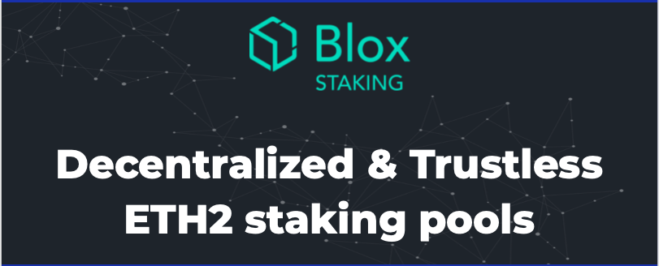

This is a development version of an isolated Casper + ghost consensus built as an SKD. The rational is to have the consensus layer as an SDK to be able to extend it with custom states.

<b> Part of [Blox's eth2-staking-pools-research](https://github.com/bloxapp/eth2-staking-pools-research)